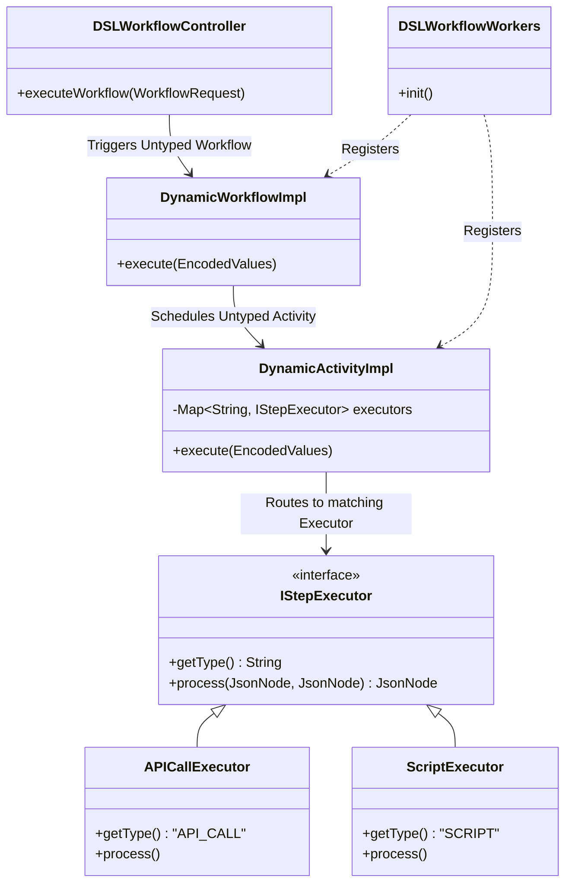
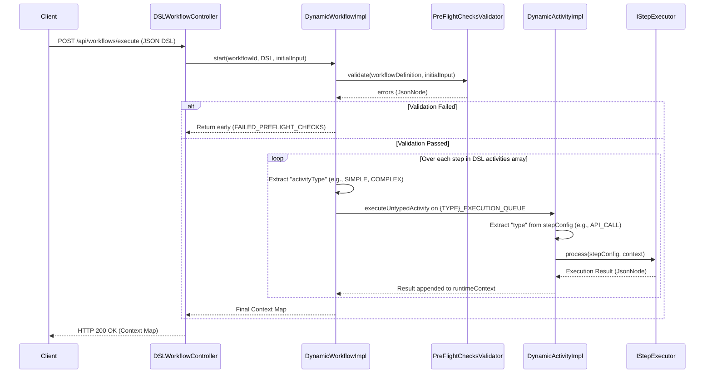

# Dynamic Workflows Engine with Temporal

This project is a dynamic, Domain Specific Language (DSL) driven workflow engine built on top of [Temporal.io](https://temporal.io/) and Spring Boot. It allows you to execute complex workflows defined entirely in JSON without writing specific Java code for each new workflow logic.

## Architecture & Design

> **📖 Note:** For a comprehensive deep-dive into the architectural decisions, personas, deployment topology, and non-functional requirements, please refer to the [Architecture & Design Document](docs/architecture.md).

The engine leverages Temporal's `DynamicWorkflow` and `DynamicActivity` interfaces to handle arbitrary JSON payloads. It parses the DSL and dynamically schedules and routes activities to appropriate executor implementations using the Strategy Design Pattern.

### Component Structure



### Dynamic Worker & Task Queue Routing

The engine features a scalable worker configuration based on the `ActivityType` enum. 
At application startup, `DSLWorkflowWorkers` dynamically provisions multiple Temporal workers, each listening to a dedicated task queue (e.g., `SIMPLE_EXECUTION_QUEUE`, `COMPLEX_EXECUTION_QUEUE`).

At runtime, the `DynamicWorkflowImpl` inspects the `activityType` property of each activity defined in the JSON payload (defaulting to `SIMPLE` if omitted) and routes the execution dynamically to the corresponding Temporal task queue. This allows for fine-grained resource allocation and scaling based on the complexity or domain of the task.

### Execution Flow

When a REST call is made, the controller initiates a workflow. The workflow reads the JSON definition and sequentially triggers activities. Each activity determines its type and routes execution to a registered `IStepExecutor`.



## Key Components

1. **[DSLWorkflowController](src/main/java/com/nageshwarsaini/dynamic/workflows/controller/DSLWorkflowController.java)**  
   Exposes a REST endpoint `/api/workflows/execute` that accepts a `WorkflowRequest`. It interacts with the Temporal `WorkflowClient` to spin up an untyped workflow execution matching the requested DSL name.

2. **[DynamicWorkflowImpl](src/main/java/com/nageshwarsaini/dynamic/workflows/DynamicWorkflowImpl.java)**  
   Implements `io.temporal.workflow.DynamicWorkflow`. It iterates over the `"activities"` array in the JSON definition, schedules them as untyped activities, and maintains a `runtimeContext` accumulating results from each step.

3. **[DynamicActivityImpl](src/main/java/com/nageshwarsaini/dynamic/workflows/activity/DynamicActivityImpl.java)**  
   Implements `io.temporal.activity.DynamicActivity`. This acts as a router. When an activity is triggered, it extracts the `"type"` from the step configuration and delegates the processing to the matching `IStepExecutor`.

4. **[IStepExecutor](src/main/java/com/nageshwarsaini/dynamic/workflows/steps/api/IStepExecutor.java) (Strategy Pattern)**  
   Defines the API for executing specific types of tasks. Implementations are auto-discovered and registered by Spring:
   - **`APICallExecutor`**: Handles `API_CALL` types (mocked API responses).
   - **`ScriptExecutor`**: Handles `SCRIPT` types (evaluates code snippets).

5. **[DSLWorkflowWorkers](src/main/java/com/nageshwarsaini/dynamic/workflows/worker/DSLWorkflowWorkers.java)**  
   Responsible for starting Temporal worker polling loops on application startup (`@PostConstruct`) and tearing them down gracefully (`@PreDestroy`). It dynamically provisions separate workers for each `ActivityType`, registering the dynamic workflow and activity implementations to their respective task queues.

6. **[PreFlightChecksValidator](src/main/java/com/nageshwarsaini/dynamic/workflows/validator/impl/PreFlightChecksValidator.java)**  
   Validates the incoming workflow definition and payload before executing any dynamic activities. If the validation fails, the workflow intercepts the errors and gracefully exits with a `FAILED_PREFLIGHT_CHECKS` status, skipping all activity executions.

## Running Locally

To run this project locally, you will need a running Temporal development server and Java 17+ with Maven.

1. **Start the Temporal Server:**
   Using the [Temporal CLI](https://docs.temporal.io/cli/#install):
   ```bash
   temporal server start-dev
   ```
   This will start the local Temporal Server and the Web UI (accessible by default at `http://localhost:8233`).

2. **Run the Spring Boot Application:**
   In a new terminal window, navigate to the project directory and start the engine using Maven:
   ```bash
   mvn spring-boot:run
   ```

## Usage

Send a POST request to `/api/workflows/execute` with a JSON payload defining the workflow logic.

**Example Request:**

```json
{
  "workflowName": "Onboarding",
  "definition": {
    "activities": [
      {
        "name": "Validate User",
        "type": "API_CALL",
        "activityType": "SIMPLE",
        "inputs": {
          "endpoint": "/v1/person/{personId}",
          "httpMethod": "GET"
        }
      },
      {
        "name": "Get Documents",
        "type": "API_CALL",
        "activityType": "COMPLEX",
        "inputs": {
          "endpoint": "/v1/documents/{personId}",
          "httpMethod": "GET"
        }
      },
      {
        "name": "Parse Documents",
        "type": "SCRIPT",
        "activityType": "SIMPLE",
        "inputs": {
          "script": "var x; x=\"success\"; return x;"
        }
      }
    ]
  },
  "input": {
    "requestingUser": "Nageshwar Saini"
  }
}
```
