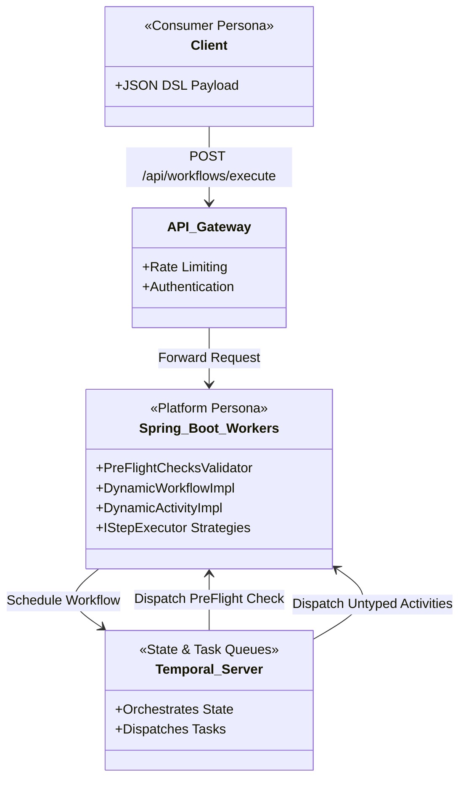
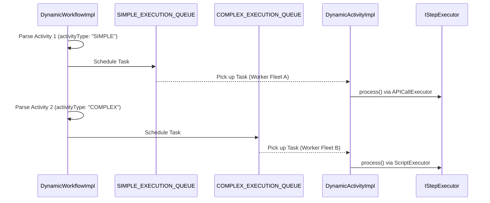
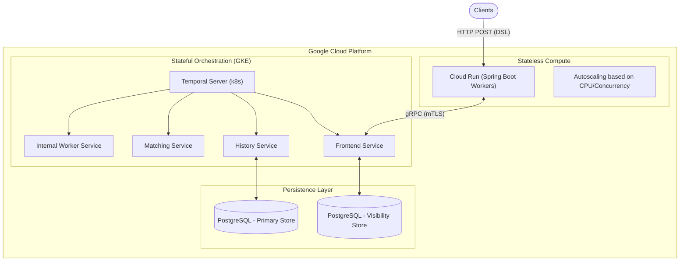

# Dynamic DSL Workflow Engine - Architecture & Design Document

## 1. Problem Statement & Motivation

In traditional distributed systems, orchestrating complex business processes (e.g., user onboarding, document processing, pipeline automation) requires hardcoding execution sequences into the core application logic. 
This traditional approach suffers from several critical bottlenecks:
- **High Engineering Overhead**: Every new workflow or modification requires developer bandwidth, code changes, recompilation, testing, and deployment.
- **Lack of Governance**: Platform engineering teams struggle to enforce global Non-Functional Requirements (NFRs) like strict timeouts, retries, rate-limiting, and security validations uniformly across scattered, hardcoded orchestrations.
- **Slow Time-To-Market**: Business logic is heavily coupled with platform infrastructure, making it difficult for product teams to iterate rapidly.

**The Solution:** A DSL-driven dynamic workflow engine built on top of Temporal.io. This solution decouples workflow orchestration from code by interpreting JSON payloads dynamically at runtime. It empowers consumers to define complex behaviors via configuration while allowing the platform team to maintain rigorous control over execution semantics, security, and scaling.

---

## 2. Personas & Operating Model

To scale effectively, the system divides responsibilities between two distinct personas:

### 👨‍💻 Workflow Consumers (Product/Integration Teams)
- **Role**: Define and manage the business logic.
- **Responsibility**: Write JSON payloads (DSL) specifying the sequence of activities (e.g., API calls, scripts, data transformations).
- **Benefit**: No knowledge of Java, Spring Boot, or Temporal is required. They interact purely with a stateless REST API.

### 🛠️ Platform Team (Core Engineering)
- **Role**: Build and maintain the underlying dynamic engine.
- **Responsibility**: Develop custom `IStepExecutor` strategies, manage the Temporal worker fleet, enforce preflight security validations, tune task queue scaling, and oversee infrastructure deployments.
- **Benefit**: Complete control over execution contexts and security without needing to understand the shifting business logic of every consumer workflow.

---

## 3. High-Level Architecture

The architecture utilizes Temporal's dynamic execution features (`DynamicWorkflow` and `DynamicActivity`) to process untyped data safely.

### Core Components
- **DSLWorkflowController**: The REST entry point. Receives the JSON payload and instructs the Temporal `WorkflowClient` to spin up a new untyped workflow execution.
- **PreFlightChecksValidator**: A strongly-typed initial gateway activity. It guarantees structural integrity (e.g., validates the presence of an `"activities"` array) and authorizes the payload (e.g., user entitlement checks) before Temporal commits any resources to subsequent steps. If this fails, the workflow gracefully aborts.
- **DynamicWorkflowImpl**: Iterates over the validated DSL array, scheduling untyped activities on specific task queues based on their defined complexity.
- **DynamicActivityImpl**: A generic activity router. It extracts the `"type"` from the payload and delegates execution to the appropriate `IStepExecutor`.
- **IStepExecutor (Strategy Pattern)**: The extensibility layer. Concrete implementations (`APICallExecutor`, `ScriptExecutor`) perform the actual heavy lifting.

---

## 4. Control Flow & Task Routing Flexibility

A primary design goal is providing flexibility around isolating **Simple** (lightweight API proxying) vs. **Complex** (heavy data parsing/scripting) operations to prevent resource exhaustion.

The engine parses an `activityType` property from the consumer's DSL (defaulting to `SIMPLE`). It dynamically routes the execution to dedicated Temporal task queues (e.g., `SIMPLE_EXECUTION_QUEUE`, `COMPLEX_EXECUTION_QUEUE`).

**Why this matters:**
- Prevents "noisy neighbor" problems. A backlog of CPU-intensive script evaluations will not stall lightweight API orchestration tasks.
- Allows the Platform team to independently scale worker fleets based on queue metrics.

---

## 5. Deployment Topology

The application leverages a hybrid cloud-native deployment model ensuring high availability, infinite horizontal scalability for stateless workers, and robust state persistence.

### Self-Hosted Infrastructure
- **Temporal Cluster**: Deployed on Kubernetes (e.g., Google Kubernetes Engine - GKE) utilizing helm charts. Handles state preservation, timers, and task queues.
- **Workers (Spring Boot Engine)**: Deployed to **Google Cloud Run**. The application acts as both the HTTP ingress for clients and the gRPC Temporal Worker polling for tasks. Cloud Run natively scales the worker fleet from 0-to-N based on traffic concurrency.

---

## 6. Migration Compatibility: Moving to Temporal Cloud

The architecture was intentionally designed to support a seamless future migration from the self-hosted Kubernetes Temporal cluster to **Temporal Cloud (SaaS)**.

Because the underlying worker application relies strictly on standard Temporal SDK abstractions, **zero business logic or framework code changes are required** to execute this migration.

**Migration Steps (Future-State):**
1. Provision a Namespace in Temporal Cloud.
2. Generate mTLS client certificates.
3. Update the Cloud Run environment variables (`TEMPORAL_TARGET_ENDPOINT`, `TEMPORAL_NAMESPACE`, and certificate paths).
4. Restart the Cloud Run fleet. The workers will seamlessly detach from the self-hosted GKE cluster and begin polling the Temporal Cloud endpoints.

---

## 7. Multi-Tenancy & Namespace Provisioning

To support B2B SaaS deployments, the dynamic workflow engine architecture embraces a strict multi-tenancy model leveraging **Temporal Namespaces**. Namespaces in Temporal provide strong isolation for workflow executions, visibility stores, and data retention rules between different tenants.

### Dynamic Provisioning & Zero-Downtime Registration
When a new tenant is provisioned within the primary application (e.g., via a Control Plane or Admin Dashboard), the corresponding Temporal namespace is provisioned dynamically on the fly without restarting the engine:

1. **Self-Hosted (Kubernetes)**: 
   The platform's control plane uses the internal API (`POST /api/internal/tenants/register`). This triggers the application to use the Temporal Java SDK's `WorkflowServiceStubs` (specifically passing a `RegisterNamespaceRequest`) to programmatically create the namespace directly via the gRPC API.
   
2. **Dynamic Worker Allocation**: 
   Once the namespace is created, the worker engine instantiates a new `WorkerFactory` polling loop for the new tenant. These factories are cached in a `ConcurrentHashMap` allowing the Spring Boot workers deployed on Cloud Run to poll multiple tenant namespaces dynamically in real-time, completely bypassing the need for a container restart.

### Execution Isolation & Context Management
- **Tenant Context**: To keep the core API (`POST /api/workflows/execute`) clean, the engine leverages a Spring `TenantFilter`. The filter extracts the `X-Tenant-ID` HTTP header and stores it in a `ThreadLocal` `TenantContext`. This guarantees that execution threads are tightly scoped to the tenant's namespace, preventing cross-tenant data leakage.
- **Data Segregation**: Workflows running in `tenant-A` are entirely isolated from `tenant-B`. Querying visibility data across namespaces ensures tenant privacy.

### Production Path: Fleet Sharding for Scalability

As the number of tenants grows to hundreds or thousands, a single Cloud Run instance dynamically polling every single namespace will encounter **thread exhaustion**. Every active namespace requires dedicated polling threads; therefore, scaling out 1,000 tenants across a horizontally scaled Cloud Run infrastructure could result in tens of thousands of idle polling loops crashing the containers and overloading the Temporal cluster.

To mitigate this while maintaining strict data isolation (Namespace-per-tenant), the production architecture must adopt **Fleet Sharding**:

1. **Partitioned Deployments**: The Spring Boot worker application is deployed as multiple separate, identical Cloud Run services (e.g., `worker-fleet-1`, `worker-fleet-2`).
2. **Tenant Assignment**: A centralized Control Plane acts as the Tenant Assigner. When a new tenant is provisioned, the Control Plane selects a fleet with available capacity.
3. **Targeted Registration**: The Control Plane calls `POST /api/internal/tenants/register` **only** on the URL of the assigned fleet (e.g., `fleet-2`). Thus, `fleet-2` spins up the worker threads for that specific tenant, while `fleet-1` remains completely unburdened.
4. **API Gateway Ingress**: An API Gateway sits in front of the Cloud Run fleets. It inspects the `X-Tenant-ID` header of incoming `POST /api/workflows/execute` requests and routes the traffic exclusively to the specific Cloud Run fleet responsible for that tenant.

This ensures unbounded horizontal scalability without sacrificing strict namespace data segregation or the zero-downtime dynamic worker allocation model.
---

## 8. Non-Functional Requirements (NFRs) & Extensibility

### Ease of Extensibility
Adding a new capability (e.g., a `KafkaPublishExecutor`) requires exactly zero changes to the core workflow logic. The platform team simply implements the `IStepExecutor` interface and tags it as a Spring `@Service`. The `DynamicActivityImpl` auto-discovers it, and consumers can immediately use `"type": "KAFKA_PUBLISH"` in their JSON payload.

### Resilience and Durability
- **Process Failure**: If a Cloud Run instance terminates unexpectedly mid-execution (e.g., Out of Memory or eviction), Temporal retains the state. A new worker instance will pick up the task where it left off.
- **Idempotency**: Execution results are cached in Temporal's history. Re-running the same workflow ID does not blindly re-trigger external `API_CALL`s unless explicitly configured.

### Performance & Scaling
- Temporal worker threads poll task queues aggressively using long-polling.
- Cloud Run allows rapid horizontal scaling of the Spring Boot application. If the `COMPLEX_EXECUTION_QUEUE` builds up backlog, Cloud Run can scale up instances exclusively tuned with higher CPU allocations for those specific routes.
- Database bottlenecks in the self-hosted Temporal cluster (Postgres) can be mitigated by vertical scaling and isolating the Visibility store to Elasticsearch.
